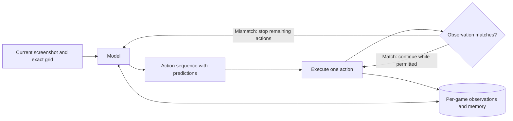

# OY1 · ARC-AGI-3 harness

[](https://github.com/OYLabsAI/arc-agi-3-api-harness/actions/workflows/verify.yml)
[](LICENSE)

OY1 runs a language model on ARC-AGI-3 games. It stores the observations from
each game so the model can retrieve an earlier frame, look up a transition or
keep a note with a reference to what happened. The model can request up to eight
actions at once, with a prediction for each step. If a check fails, the runner
stops the remaining actions and returns the observation to the model.

[Method](docs/method.md) · [Quick start](#quick-start) · [Results](docs/results.md) ·
[Reproduction](docs/reproduction.md) · [Evaluation plan](docs/evaluation-plan.md)

## How it works



The same prompt and tool interface serve every selected game. Memory starts
fresh for each game; the model receives observations and permitted actions.

| Mechanism | What it does | Implementation |
|---|---|---|
| Earlier frames | Retrieve exact earlier pixel grids, animation frames or crops | [`inspect`](harness/arc_harness/runner.py) |
| Memory notes | Store hypotheses and notes with references to observed transitions | [`Store.remember`](harness/arc_harness/store.py) |
| Action checks | Check each step in a batch of up to eight actions and interrupt when needed | [`Runner.act`](harness/arc_harness/runner.py) |
| Model context | Retain provider reasoning items and cache text history before the current image | [Provider adapter](harness/arc_harness/api_provider.py) |

For example, a model may request three moves and predict the player's position
after each one. If the first position is wrong, the runner cancels the other
two moves. See [the method](docs/method.md) for the full set of stop conditions.

## Public benchmark result

One completed live Competition Mode run, **9 September 2026**:

| Measure | Result |
|---|---:|
| Public games completed | **25 / 25** |
| Levels completed | **183 / 183** |
| Raw public score | **100.0** |
| Inference cost for this run | **$415.37** |
| Environment actions | 6,732 |
| Notebook runtime | 6 h 48 min |

Model: **OpenAI gpt-6-astra**, high reasoning effort, Standard service.
[Scorecard and replays](https://arcprize.org/scorecards/75d9c8e7-ade9-4a8f-a747-6acbea51bb1b) ·
[Per-game results and cost accounting](docs/results.md).

Across the same 25 game versions with GPT-6 Astra at high reasoning, OY1 reports
**83.03% fewer total tokens** than the published Provider Adapter replays, with
all 183 levels completed by both. [Token accounting, replay links and scope](docs/token-comparison.md).

The public games were used during development. This result does not establish
unseen-game performance or a controlled advantage over another harness.
The optional graph planner was not called in this run. No ARC Prize verification is claimed;
[community review](https://github.com/arcprize/ARC-AGI-Community-Leaderboard/pull/56)
is pending.

## Quick start

Inspect the release with Python 3.9 or newer; no installation or credentials are needed:

```sh
git clone https://github.com/OYLabsAI/arc-agi-3-api-harness.git
cd arc-agi-3-api-harness
python3 -B tools/verify_release.py
```

The verifier checks file hashes, the 74 evaluated source files, bundled source
and notebook syntax. A passing result reports `evaluated_source_files: 74` and
`paid_requests: 0`. It does not run a benchmark.

To execute the software, follow the [reproduction guide](docs/reproduction.md):

- **Synthetic fixture:** Linux x86_64, Python 3.12, CPU; no model calls.
- **Public benchmark:** the same notebook in paid mode, with evaluator-owned
  credentials, model access and an explicit spending cap.

No GPU or local model weights are required. The recorded Linux fixture passed
231 tests; [its receipt](evidence/linux-fixture.json) is separate from the
benchmark result.

## Repository guide

| Path | Contents |
|---|---|
| [`harness/`](harness/) | Frozen evaluated implementation, prompts, configuration and tests |
| [`notebooks/`](notebooks/) | Reproduction notebook with fixture and paid modes |
| [`docs/`](docs/README.md) | Method, results, reproduction, limitations and evaluation plan |
| [`evidence/`](evidence/) | Public result summaries and historical notebook |
| [`assets/`](assets/) | Source and license bundle |
| [`tools/`](tools/) | Credential-free release verification |

The `harness/` files and source bundle are the evaluated release. The
[source identity notes](docs/reproduction.md#source-identity-and-metadata) cover
their hashes and a packaging-version discrepancy.
Raw action logs, provider exports and model reasoning are not included in the
public summaries.

This repository contains the ARC benchmark harness. The hosted OY1 ChatGPT/MCP service
is a separate system and does not inherit this benchmark score.

## Contributing and citation

See [CONTRIBUTING.md](CONTRIBUTING.md) for reporting issues and proposing changes.
Cite the software using [CITATION.cff](CITATION.cff), including the exact commit
and evaluation scope.

Copyright 2026 Orca Labs sp. z o.o. / OY Labs. [Apache-2.0](LICENSE);
[third-party notices](THIRD-PARTY-NOTICES.md) and [NOTICE](NOTICE).
