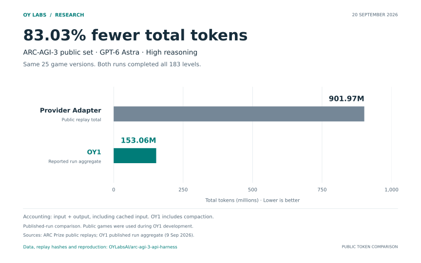
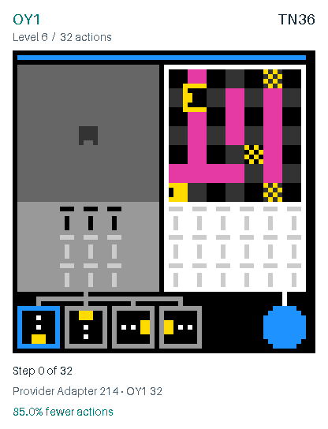
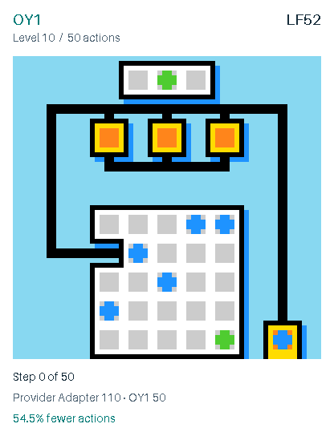
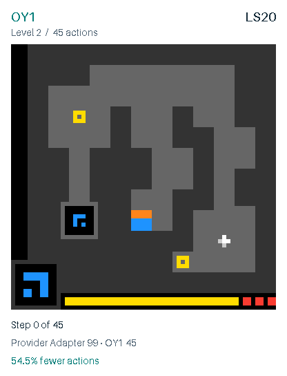
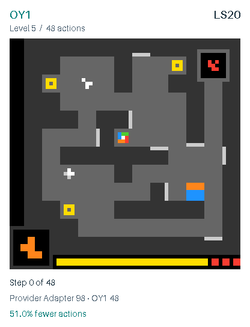

# OY1 · ARC-AGI-3

[](https://github.com/OYLabsAI/arc-agi-3-api-harness/actions/workflows/verify.yml)
[](LICENSE)

**OY1 completed all 25 public games and 183 levels with a score of 100.0.**
The run used GPT-6 Astra at high reasoning and cost **$415.37** in inference.

OY1 stores what the model observes, lets it retrieve earlier frames and notes,
and checks predicted outcomes as it executes actions. This repository contains
the harness, results and replays from the completed run on **9 September 2026**.

[Scorecard](https://arcprize.org/scorecards/75d9c8e7-ade9-4a8f-a747-6acbea51bb1b) ·
[Results](docs/results.md) · [Replays](docs/replays.md) ·
[Method](docs/method.md) · [Reproduction](docs/reproduction.md)

## Results

| Measure | Completed public run |
|---|---:|
| Public score | **100.0** |
| Games completed | **25 / 25** |
| Levels completed | **183 / 183** |
| Inference cost | **$415.37** |
| Environment actions | 6,732 |
| Notebook runtime | 6 h 48 min |

These are public-set results. The games were used during development;
held-out performance has not been measured. [Evaluation scope](docs/compliance.md).

## Token usage

On the same 25 game versions with GPT-6 Astra at high reasoning, OY1 reports
**153.06 million total tokens**, compared with **901.97 million** in the published
Provider Adapter replays: **83.03% fewer**. Both completed all 183 levels.

[](docs/token-comparison.md)

[Token accounting and sources](docs/token-comparison.md) ·
[Download chart](docs/figures/public-token-comparison.png)

## How it works

- **Recall:** retrieve an exact earlier frame, crop or transition from the current game.
- **Memory:** keep notes with references to the observations that support them.
- **Action checks:** request up to eight actions with predicted outcomes. The runner
  stops the batch on a mismatch, a level transition or another stop condition.

Memory persists across levels and starts fresh for each game. The same prompt
and tools serve every game. The model receives screenshots and grids, without
game source or stored solutions. The optional graph planner was not used in this run.

See the [method](docs/method.md) for the tool interface and implementation.

## Gameplay highlights

The four largest action reductions against ARC Prize's published OpenAI
Provider Adapter run, across all 183 matched public levels. Both runs use **GPT-6 Astra, high reasoning**. Each clip shows OY1 completing
one full level; click it for the complete game replay.

| TN36 · Level 6 · 85.0% fewer actions | LF52 · Level 10 · 54.5% fewer actions |
|---|---|
| [](https://arcprize.org/replay/22761359-7720-4a5c-acab-4432719a35c5) | [](https://arcprize.org/replay/79127723-14e2-4d3d-a60c-9a45e99e6575) |
| **OY1: 32 actions** · [Provider Adapter: 214](https://arcprize.org/replay/8d408961-f16e-419c-ad6b-12e0e697f2ca) | **OY1: 50 actions** · [Provider Adapter: 110](https://arcprize.org/replay/e1ef8feb-5393-4a69-9780-b6f7ef48ba93) |
| **LS20 · Level 2 · 54.5% fewer actions** | **LS20 · Level 5 · 51.0% fewer actions** |
| [](https://arcprize.org/replay/0a9dfe50-1421-45c9-8041-773c58b6b85b) | [](https://arcprize.org/replay/0a9dfe50-1421-45c9-8041-773c58b6b85b) |
| **OY1: 45 actions** · [Provider Adapter: 99](https://arcprize.org/replay/27b4461a-7bdb-45f6-9bb0-f1487d6ce662) | **OY1: 48 actions** · [Provider Adapter: 98](https://arcprize.org/replay/27b4461a-7bdb-45f6-9bb0-f1487d6ce662) |

Playback uses fixed timing. [All 183 level comparisons](docs/level-comparison.md) ·
[All 25 replays and rendering details](docs/replays.md).

## Run OY1

Clone the repository and check the release files:

```sh
git clone https://github.com/OYLabsAI/arc-agi-3-api-harness.git
cd arc-agi-3-api-harness
python3 -B tools/verify_release.py
```

The [reproduction notebook](notebooks/reproduce.ipynb) loads the exact source
snapshot used for the reported run. It requires Linux x86_64 and Python 3.12.
Its default mode checks the installation without model calls. To run the public
benchmark, supply your own credentials and spending cap as described in the
[setup guide](docs/reproduction.md). No GPU is required.

## Repository

| Path | Contents |
|---|---|
| [`harness/`](harness/) | Source, configuration and unit tests |
| [`notebooks/`](notebooks/) | Reproduction notebook |
| [`docs/`](docs/) | Method, results, charts and gameplay clips |
| [`evidence/`](evidence/) | Run totals, per-game results, replay index and source identity |
| [`tools/`](tools/) | Release verification, replay audit and figure generation |

For changes, see [CONTRIBUTING.md](CONTRIBUTING.md). For citation, use
[CITATION.cff](CITATION.cff) and include the commit and evaluation scope.
The [community submission](https://github.com/arcprize/ARC-AGI-Community-Leaderboard/pull/56)
is awaiting maintainer review.

Copyright 2026 Orca Labs sp. z o.o. / OY Labs.
[Apache-2.0](LICENSE) · [Third-party notices](THIRD-PARTY-NOTICES.md)
