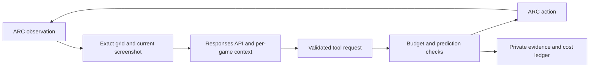

# Method and attempt disclosure

The controller uses OpenAI gpt-6-astra through the Responses API, high reasoning
effort and Standard/default service. It supplies the current screenshot,
preserves exact earlier pixel grids and opaque reasoning state across turns,
uses bounded Responses compaction, and keeps four rolling text-cache boundaries
with 30-minute minimum TTL requests. This TTL is not a maximum retention promise.
The solver receives game observations and permitted actions, not human baselines,
historical solutions, reference runs, shell/browser access or game source code.
Historical project attribution is OY1 AGI / OY Labs. See harness/reports/
METHOD.md, DATA-FLOW.md and API9-CHANGE-REVIEW.md for the preserved method.

## Contribution and generality

The contribution presented for community review is an observation-only controller
that combines exact visual history, prediction-checked actions and continuity of
provider reasoning with explicit cost reservations and an auditable live run.
Its empirical planner searches only transitions already observed in the current
game. The model can inspect history, record evidence-linked claims and choose
bounded actions through six tools: `act`, `inspect`, `history`, `remember`,
`plan`, and `stop`.

API9's particular representation keeps the current screenshot while carrying
earlier images as complete hexadecimal pixel grids. Up to four text-history
cache boundaries precede the current image. The preceding synthetic probes
motivated this layout; their scope and failures are retained in
[the frozen change review](../harness/reports/API9-CHANGE-REVIEW.md). The frozen
report predates the completed run; [results](results.md) documents its outcome.

The same solver prompt, tools and provider configuration serve every selected
game. Game IDs select environments, not solution branches. History and memory
start fresh for each game, and the solver receives neither previous attempts
nor human action baselines. It cannot run arbitrary Python or inspect environment
source through its tools. The shared instructions are in
[prompt.py](../harness/arc_harness/prompt.py), with dispatch and batch interruption
in [runner.py](../harness/arc_harness/runner.py).

The current community agents also use observation history and verified action
plans. Tycho and baseline1 describe executable world-model construction;
Retrodict describes hypothesis checks over recorded history. Those comparisons
help locate this implementation's design choices. They do not establish that
each component is novel, or that this harness improves another method under
matched conditions. No controlled cross-harness ablation was performed.
Public-game success also does not establish unseen-game performance. See
[references](references.md#2026-community-entries).

## Attempt history

| Attempt | API operations | Recorded USD | Outcome |
|---|---:|---:|---|
| API7 pilot | 6 | 0.980586 | Budget stop, 1/8 levels |
| API8 pilot | 49 | 51.284389 | Budget stop, 7/8 levels |
| Four synthetic cache probes | 23 | 0.497276 | Compared cache layouts; no public benchmark score |
| API9 pilot | 48 | 11.083319 | First public game solved, 8/8 levels |
| First full API9 run | 1310 | 300.862333 | Budget stop; raw 79.2, 19 wins, game 20 at 8/9, five unrun |
| Second full API9 run | 1773 | 415.367944 | Raw 100.0, 25 wins, all 183 levels; 37,704 independent checks passed |

Nine historical Linux fixtures were attempted: the first two failed during setup
and versions 3–9 passed their applicable checks. The final API9 fixture ran 231
tests. One later full-notebook setup failed before inference because the Secrets
path was unavailable. Version 12 was a preparation save, not an evaluation. The
completed full run was saved version 13, run 20260909T110238Z-ce055081. No scores
were combined. The earlier subscription run is a separate historical reference;
its repriced usage was not an API invoice or a reliable budget prediction.

After the benchmark, the community-release wrapper passed a separate Linux
fixture: 231 regression tests, no API operations and no inference cost. Its
[receipt](../evidence/linux-fixture.json) identifies that packaging check; it
does not add another benchmark attempt or alter the campaign cost below.

The campaign totals 3,209 API operations. Provider consumption was USD 780.075046;
the conservative per-request ledger totals USD 780.075847. The USD 0.000801
difference is fully explained by rounding each request upward to micro-USD.
The successful run's unrounded usage calculation is USD 415.3674960. Original
provider exports, paid credit invoices, raw scorecard and action/usage evidence
are retained privately. Credit purchases and VAT are separate from token costs.

The review wrapper changes source retrieval and requires a fresh evaluator
approval record for paid runs. The source manifest and all 74 evaluated files
are unchanged. Review wrapper checks are software validation, not another paid
100-point run. The public result does not establish ARC Prize verification.

## Controller structure

The empirical planner uses previously observed transitions only. Batches contain
at most eight actions and stop on prediction failure, no visual change, a level
transition or terminal state. Memory is scoped to the current game. The public
environments were used in earlier development and subscription runs; they are
not held-out tasks. No game-ID solution lookup or historical answer replay was
introduced into the evaluated solver.

| Source module | Responsibility |
|---|---|
| `harness/arc_harness/api_provider.py` | Provider requests, opaque state, compaction and usage |
| `harness/arc_harness/runner.py` | Observation/action loop and predictions |
| `harness/arc_harness/api_budget.py` | Reservations, accounting and stop bounds |
| `harness/arc_harness/release_integrity.py` | Exact source identity |
| `harness/scripts/bootstrap.py` | Fresh environment, installation and supervision |
| `harness/scripts/independent_audit.py` | Standalone result/evidence consistency checks |

`store=False`, `background=False` and requested cache TTL do not establish a
protected-data retention agreement. Organizer live mode stays disabled pending
the real dataset interface and agreed handling policy.
